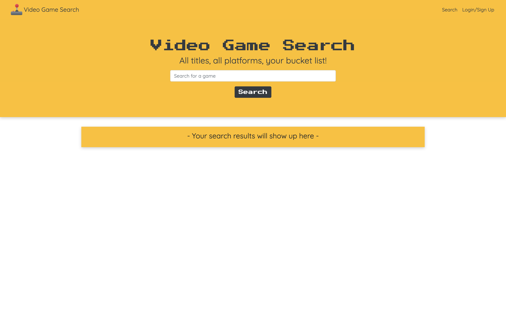
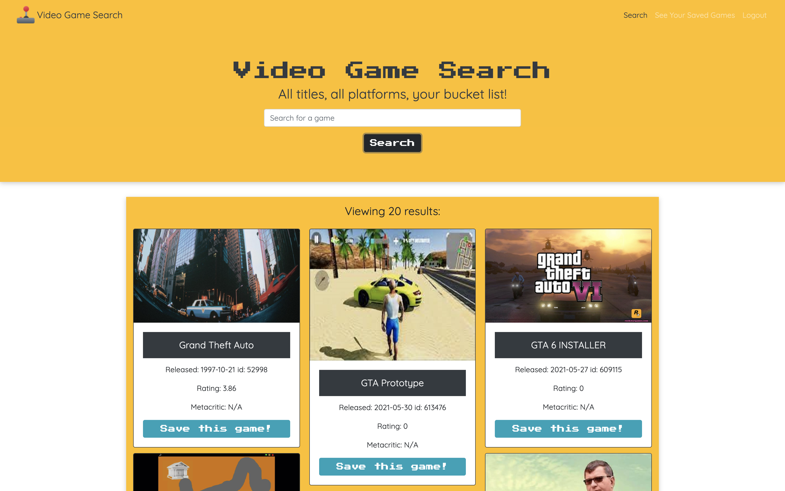

# **Video Games**

This project allows users to create an account and utilize the RAWG API to search in a video game library. The user can add the title to their favorites page and view different parameters of that specific game such as rating, meatacritic and release date.

---

## **Table of Contents**

1. [Links](#Links)
2. [Built With](#Built-With)
4. [Contributors](#Contributors)

---

## **Links**

[Deployed application](https://blooming-beyond-40284.herokuapp.com/)\
[Github repository](https://github.com/samersaemeldahr/Video-Games)

---

## **Built With**

* MongoDB / Mongoose
* Express
* React
* Node
* GraphQL / Apollo
* Queries and mutations
* Json Web Tokens
* Google Fonts
* RAWG API

---

## **Contributors**

[Samer Saem Eldahr](https://github.com/samersaemeldahr)\
[Nicholas Held](https://github.com/nicholasheld)\
[Nadhi Woliye](https://github.com/nadhiiw)\
[William Flemister](https://github.com/DW568)\
[Luis Garcia-Jacquez](https://github.com/Gatillo00)